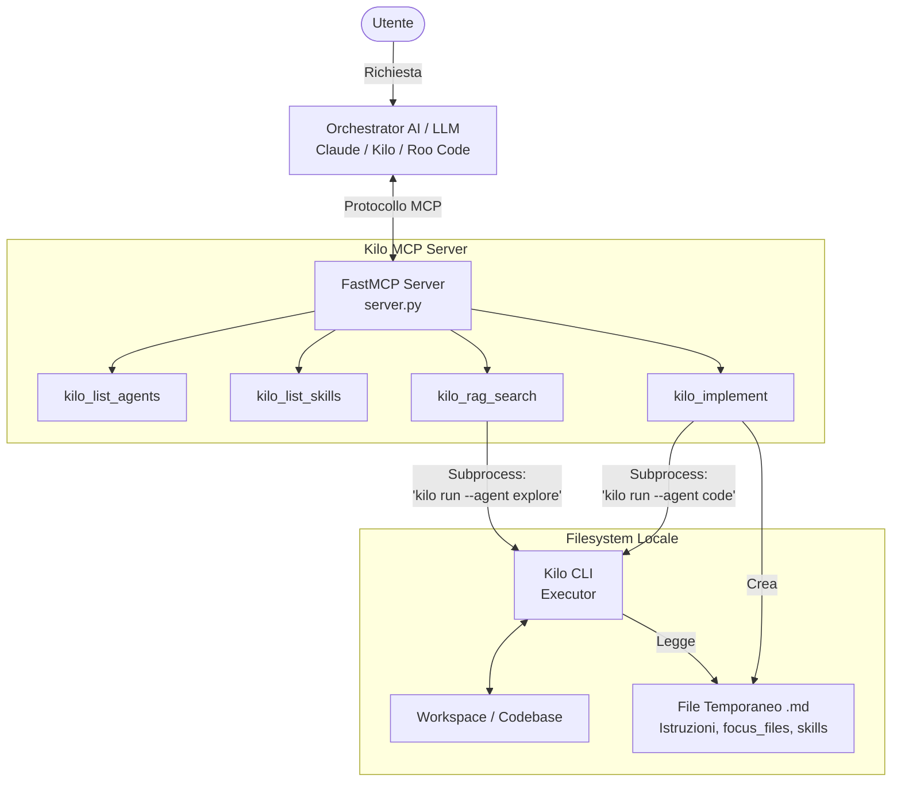
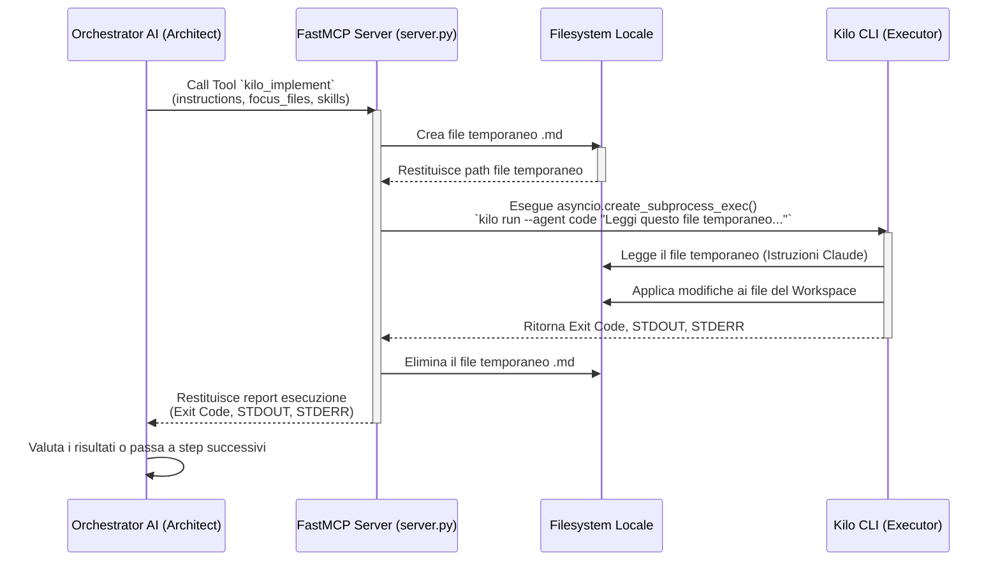

# Architecture & Design Context

This document captures the original design discussions, specifications, and architectural choices made when building the Kilo MCP Server. It serves as a context bridge for future sessions.

## The Core Philosophy: Architect vs. Executor

The fundamental reason for this tool's existence is the separation of concerns between two distinct AI personas:

1. **The Orchestrator / Architect (e.g. Claude, Kilo, Roo Code):**
    * **Role:** Tech Lead, System Designer, Reviewer.
    * **Strengths:** High-level reasoning, architectural planning, managing complex constraints, writing highly detailed specifications, and coordinating workflows.
    * **Weaknesses:** Expensive and slow for massive multi-file codebase refactorings. Pulling an entire workspace into context just to find a few files is inefficient.
    * **Responsibilities:**
        * Receive user requests.
        * Use `kilo_rag_search` to cheaply and quickly find relevant context in large codebases.
        * Design the system architecture.
        * Write the execution prompt/specifications.
        * Delegate the actual coding to Kilo using `kilo_implement`.
        * Review the final output provided by Kilo.

2. **KiloCode / Executor Model (The Executor):**
    * **Role:** The Developer, The "Doer".
    * **Strengths:** Massive context window, incredibly fast execution, native workspace awareness, Agent Manager capabilities (parallel worktrees), and built-in semantic search.
    * **Responsibilities:**
        * Receive specifications from Claude.
        * Read the exact `focus_files` indicated.
        * Load specific `skills_to_load` if requested.
        * Write code, refactor, and solve local compilation/linting errors.
        * Report back to Claude with `stdout`/`stderr`.

## Technical Design Choices

### 1. The Temporary File Bridge

When Claude delegates a complex architectural task, the prompt can be extremely long (thousands of characters of Markdown, code snippets, etc.).

* **Problem:** Very long specs passed as a single process argument risk hitting the OS argument-size limit (`ARG_MAX`), and give Kilo no durable artifact to re-read mid-task. (Note: since the server spawns Kilo via `asyncio.create_subprocess_exec` - no shell - classic shell-escaping is *not* a concern.)
* **Solution:** The MCP server writes the full specification to a `.md` file via Python's `tempfile` module, with a deliberate section order: **Context Files first** (read before acting), then Task Instructions, Execution Hints, Required Skills, and finally a **mandatory Final Report contract** (Outcome / Files changed / Verification / Issues) that Claude-as-reviewer parses from STDOUT. Kilo is told to read the file and execute it; the server deletes the file in a `finally` block after the subprocess exits (Kilo is never asked to clean it up - that would waste an execution step).

### 2. Non-Interactive Execution via `kilo run`

Kilo is primarily an interactive CLI (approving tool calls, picking options in a TUI).

* **Problem:** If Claude spawns Kilo in the background, an interactive session would hang indefinitely waiting for user input (e.g., "Do you want to edit this file? [y/N]").
* **Solution:** The MCP server invokes the **`kilo run "<prompt>"`** subcommand. `kilo run` is *non-interactive by default*: it sends a single prompt, streams events to stdout, and exits when the session goes idle (interactive mode requires an explicit `--interactive` flag). No special environment variable is needed. *(An earlier design assumed a `KILO_NON_INTERACTIVE=1` env var; that variable does not exist in the CLI and was removed.)*

### 3. Dynamic Environment Override

The `kilo_implement` tool exposes an `env_vars` dictionary parameter.

* **Why:** Claude might need to debug a failing Kilo instance or override Kilo's internal configuration without modifying the `.kilo/kilo.json` files on disk. By passing `{"KILO_CONFIG_CONTENT": "{...}"}` or `{"DEBUG": "1"}`, Claude has absolute control over Kilo's runtime state.

### 4. Parallelism via MCP

Because the server is built asynchronously (`async def`) using `fastmcp`, Claude can emit "Parallel Tool Calls".

* If Claude decides to implement 3 separate features, it can call `kilo_implement` 3 times in the same turn. **This describes the synchronous (`background=false`) path** - it launches each Kilo instance with `asyncio.create_subprocess_exec` (via the `_run_kilo` helper), **not** the blocking `subprocess.run`. This matters: `subprocess.run` would block the single asyncio event loop and force the calls to run one after another. With the async subprocess API each call yields control while Kilo runs, so the 3 instances execute truly concurrently, fully utilizing the host machine's resources. The default `background=true` path spawns Kilo as a detached `subprocess.Popen` instead (see [Background Execution Reliability](#8-background-execution-reliability-detached-processes) below) - parallelism there comes from each launch being a genuinely independent OS process, not from the asyncio event loop.
* Each subprocess is wrapped in `asyncio.wait_for` with a timeout (`KILO_MCP_TIMEOUT`, default 1800s). On timeout the process is killed and reaped, and a clear error is returned to Claude instead of hanging the tool call.
* **This is a throughput feature, not a safety one - true concurrency also means true write collisions are possible.** `asyncio.create_subprocess_exec` gives independent processes, not independent working trees: if two `kilo_implement` calls (or one such call and the orchestrator's own `git` commands) target the same `working_directory`, nothing in the server serializes or arbitrates between them. There is no lock file, no mutex, no directory-level guard - `_find_running_tasks_for_cwd`/`_collision_warning` only *surface* an already-running collision as a warning prefixed to the response; they do not prevent one. The actual isolation mechanism is `git worktree` (`kilo_implement(isolation='worktree')`, or `kilo_create_worktree` directly): a real, separate working tree and branch per task, which is what makes parallel delegation against one repository safe rather than merely fast. See [Concurrency & Isolation](README.md#-concurrency--isolation) in the README for the operator-facing guidance this design implies.

### 5. Semantic Search Delegation (RAG)

Instead of Claude asking the user to copy-paste files or trying to read the whole repo, Claude uses `kilo_rag_search`.

* This tool uses Kilo's `explore` agent, which is optimized for semantic codebase indexing. Kilo finds the files, extracts the relevant snippets, and returns a summary to Claude. Claude gets the exact context it needs for a fraction of the cost and time.
* **Direct Resource via Server Instructions:** The server is initialized with MCP `instructions` (`_SERVER_INSTRUCTIONS`) that explicitly tell the connected assistant to use `kilo_rag_search` directly for its *own* exploration and Q&A, not just as a scoping step before delegation. Because these instructions are delivered during the MCP initialization phase, the directive travels with the server installation and requires no per-user prompt setup. It is a standing resource for conceptual queries on indexed workspaces.

### 6. Configurable Cost Model and Delegation Policy

Kilo execution is not inherently free. While operators using institution-supplied API keys might incur no direct Kilo token costs, others pay the standard rates for the model used by Kilo (e.g., Gemini 3.1 Pro).

* **Cost Tracking:** The server uses the `[kilo]` config keys `input_cost_per_mtok` and `output_cost_per_mtok` (with their corresponding environment variables `KILO_MCP_KILO_INPUT_PER_MTOK` and `KILO_MCP_KILO_OUTPUT_PER_MTOK`, both defaulting to `0.0`) to define Kilo's token costs. The `_estimate_costs()` function breaks down the total into `claude_cost_usd` (spec writing and result reviewing) and `kilo_execution_cost_usd` (Kilo's agentic loop, estimated as output tokens × `inline_output_factor`, and input as output × `inline_input_per_output`). These sum up to `delegation_cost_usd`, which is then compared against `inline_estimate_usd` to calculate `estimated_savings_usd`.
* **Dynamic Delegation Policy:** If Kilo costs are `0.0`, the server injects `_DEFAULT_POLICY_FREE` into the `kilo_implement` description, telling Claude to delegate broadly since Kilo's heavy loop is free. If either cost is > 0, it switches to `_DEFAULT_POLICY_PAID`, advising Claude to delegate only when Kilo's per-token rate on the heavy loop outweighs the Claude spec+review overhead. This can still be manually overridden via `KILO_MCP_DELEGATION_POLICY`.
* **Metrics:** The `kilo_metrics` tool parses the JSONL records and surfaces this cost breakdown directly to Claude, showing exactly how much was spent on Claude vs. Kilo, and what the estimated savings were. It explicitly formats the breakdown as "cost of delegating: $X (Claude spec+review $Y + Kilo execution $Z)" when Kilo costs are > 0, or "(Claude spec+review; Kilo execution at no cost)" when it is free.

### 7. Non-Blocking by Default, with Complexity-Scaled Monitoring & Intervention

The original design made `kilo_implement` synchronous with an opt-in `background=true` escape hatch. In practice this meant the calling assistant's own prompt stayed blocked for the whole delegation whenever it forgot to opt in - including, in one real session, for **almost 11 hours** on a run that had actually gone stuck. Two changes fixed this:

* **Background is now the default.** `kilo_implement` always returns a `task_id` immediately; `background=false` is the opt-in for the rare case where blocking for the full report in the same call is actually preferable (a short, low-risk task). This removes the failure mode entirely instead of relying on the caller to remember a flag.
* **Monitoring depth should scale with task risk, not be uniform.** A small, well-scoped delegation only needs a final `kilo_task_result` check. A large, multi-file, or high-stakes one deserves to be watched while it runs - so two tools exist at different fidelities:
  * `kilo_task_status` - the original OS-level heuristic (`pgrep`/`ps`/`lsof` + the matching session's last DB write), useful for *any* `kilo run` process, including ones with no known `task_id` (another session's foreground run, or one predating this server's task tracking).
  * `kilo_task_progress` - reads Kilo's *own* live plan straight from its session database (`~/.local/share/kilo/kilo.db`): the `todo` table (Kilo's per-step plan with status pending/in_progress/completed - the same structure the TUI shows the user), the `part` table (a tail of Kilo's actual streamed commentary), and the `session` row (running cost/tokens).
* **Direct Server API Integration & Synchronous Session Creation (Evolved 2026-08-06):**
  * `kilo-mcp` now automatically discovers and connects to an active `kilo serve` instance (via `_discover_active_kilo_server`).
  * On `kilo_implement` invocation, `kilo-mcp` attempts to create the session synchronously via `POST /session`, ensuring that `session_id` is bound immediately on launch rather than waiting for a DB match or polling delay.
  * **Intervention via Native REST API**: `kilo_task_cancel` sends an HTTP abort request (`POST /session/:id/abort`) to `kilo serve` before resorting to OS signal hard-kills. `kilo_implement(continue_session_id=...)` uses `_kilo_server_prompt_async` to queue prompts directly into active sessions.
  * **Advanced Session Control Tools**:
    * `kilo_session_revert`: Reverts a session back to a previous message/checkpoint via `POST /session/:id/revert`.
    * `kilo_session_fork`: Forks an existing session at a specific checkpoint via `POST /session/:id/fork`.
    * `kilo_respond_question`: Answers interactive questions asked by Kilo via `POST /question/:id`.
    * `kilo_get_session_todo` & `kilo_update_session_todo`: Allows the Architect to inspect or directly inject/update the todo checklist in Kilo's database.
    * `_kilo_server_fetch_session_events`: Connects to `kilo serve`'s SSE stream (`GET /event`) for native event streaming.

### 8. Background Execution Reliability (detached processes)

§7 established `background=true` as the default; this section covers how that background path actually runs the subprocess, and three real bugs (found and fixed 2026-07-29) in that mechanism - all three surfaced only through **live testing against the real MCP protocol**, not unit tests mocking the subprocess-spawn seam, because they are process-lifetime and stdin-inheritance bugs that only manifest with a real OS process and a real MCP transport.

* **The original background design (now removed):** `asyncio.create_task(_runner())`, where `_runner()` awaited `_execute_implement(...)` → `_run_kilo(...)` → `proc.communicate()` (in-memory captured stdout, no log file). Both the `asyncio.Task` and the subprocess it awaited lived and died with the MCP server's own process - a server restart, crash, or client disconnect silently killed the running Kilo subprocess with it, and the task record stayed at `status: "running"` forever because the only code path that would ever flip it died along with the server.
* **The fix - `_spawn_kilo_background`:** the background path now launches Kilo via plain `subprocess.Popen(cmd, cwd=cwd, env=env, stdin=subprocess.DEVNULL, stdout=log_fd, stderr=subprocess.STDOUT, start_new_session=True)`, writing output to a real log file (`TASKS_DIR/<task_id>.log`) instead of capturing it in an awaited pipe. `start_new_session=True` (`setsid`) puts the child in its own session/process group, immune to whatever signal/teardown kills the MCP server's own process group. The task record (`status: "running"`, `pid`, `log_path`, …) is written **synchronously, immediately** after spawning - no `asyncio.create_task` involved, since the OS process is now independent of this server call returning at all.
* **Bug - inherited stdin.** A subprocess launched without an explicit `stdin` inherits the parent's - which for an MCP server is the client's JSON-RPC stdio pipe, not a terminal or `/dev/null`. Isolated by comparing a direct CLI invocation (97% CPU, completed normally) against the identical command launched through the MCP server (0% CPU, hung indefinitely) with otherwise-identical `cmd`/`cwd`/`env`. Fixed by always passing `stdin=subprocess.DEVNULL` explicitly in `_spawn_kilo_background`.
* **Bug - zombies reported as "alive".** `os.kill(pid, 0)` succeeds for a zombie (exited, not yet reaped by its parent) - a naive liveness check reports a genuinely-finished task as still running forever. `_is_pid_alive` now calls `os.waitpid(pid, os.WNOHANG)` first (reaping if the child has exited) and only falls back to `os.kill(pid, 0)` if no child was reaped. The regression test for this (`test_is_pid_alive_treats_unreaped_zombie_as_dead`) deliberately avoids `proc.poll()`/`proc.wait()` in its setup, since Python's own bookkeeping in those calls would reap the zombie and hide the exact bug being tested.
* **Self-healing reconciliation (`_reconcile_task_if_orphaned`):** called at the top of `kilo_task_status`, `kilo_task_progress`, and `kilo_task_result`. If a record says `status == "running"` but `_is_pid_alive(pid)` is false, it reads the log file, resolves `session_id` via `_find_session_for_task` if not already known, runs the existing (unchanged) `_parse_final_report` against the log content, and writes back `status: "completed"`/`"failed"` with the reconstructed result. This works identically regardless of which server *instance* answers the call - PID liveness and the log file are OS-level state, not in-process state - which is what makes the fix survive a server restart, not just a crash within the same process lifetime. `_find_running_tasks_for_cwd` (the same-directory collision guard) applies the same liveness check before treating a `"running"` record as a real collision, so it doesn't warn about orphaned records nobody has reconciled yet.
* **Worktree creation locking:** `_create_worktree`'s `git worktree add` invocation is wrapped in an `asyncio.Lock()` keyed by `os.path.realpath(cwd)` (`_worktree_lock_for`), serializing concurrent worktree creation attempts against the same repo from this server process - mirrors the mutex the real Kilo VS Code extension uses internally around the same git operation (found while reading its source), closing the `.git/index.lock` race for concurrent `kilo_implement(isolation='worktree')` calls in the same turn.
* **Known open gap, found 2026-07-29, not yet fixed:** in 3/3 background tasks observed during live verification of the fixes above, the `kilo` binary itself (v7.4.5) did not exit on its own after finishing its work and writing its Final Report - the process stayed alive at 0% CPU indefinitely until killed manually, confirmed by comparing the log content (a complete Final Report, matching commits already on disk) against `ps` showing the PID still resident. Once killed, `_reconcile_task_if_orphaned` correctly recovers the outcome - so the self-healing mechanism above still works - but nothing kills a process like this automatically today, so `kilo_task_status`/`kilo_task_progress`/`kilo_task_result` would keep reporting `"running"` indefinitely for it otherwise. Not yet root-caused (candidates: something specific to a detached, controlling-terminal-less process with `stdin=DEVNULL`; an idle-wait loop that never gets satisfied; unrelated to the worktree vs. non-worktree distinction - reproduced in both). A bounded reap (e.g. treat a task as done once its log shows a parseable Final Report even if the PID is still alive, or a timeout-based SIGTERM after the report is seen) would close this, but needs the root cause first to avoid masking a different underlying problem.

### 9. Agent Manager Integration (`.kilo/agent-manager.json`)

Added 2026-07-29, alongside the reliability fixes in §8. The Kilo VS Code extension's own "Agent Manager" UI persists its worktree/session registry to `<repo_root>/.kilo/agent-manager.json` (`WorktreeStateManager.ts` in `kilocode/`, read directly to ground this design - not inferred from the file's shape alone). This server now writes into the same file so worktrees/sessions it creates can appear there too.

* **Resolving the repo root.** The state file always lives at the *main* repo root, never inside a worktree - confirmed by reading `WorktreeStateManager`'s constructor (`root` is the workspace root, set once). `_agent_manager_root(cwd)` resolves this uniformly for both a main checkout and a linked worktree by shelling out to `git rev-parse --path-format=absolute --git-common-dir` and taking its parent directory: for the main repo this returns `<root>/.git` → `<root>`; for a linked worktree it returns the *shared* `.git` directory of the main repo, not the worktree's own `.git` file - exactly the root the extension itself would use, without this server needing to track that mapping itself.
* **Schema and write mechanics.** `worktrees` / `sessions` / `worktreeOrder` follow the extension's own `StateFile` shape exactly (`{branch, path, parentBranch, createdAt, branchOwned, label?}` per worktree; `{worktreeId, createdAt}` per session). Writes use the same atomic tmp-file-then-`os.replace` scheme the extension's own `writeToDisk()` uses, so a concurrent reader (the extension, or this server) never observes a partially-written file. An `flock`-guarded read-modify-write (`_agent_manager_locked_update`, keyed by a `.kilo/.agent-manager.lock` file) serializes this server's *own* concurrent writers against each other - worktree creation and lazy session registration can both fire from concurrent tool calls.
* **Worktree registration** happens synchronously inside `_create_worktree`, immediately after a successful `git worktree add` - `parentBranch` is either the caller-supplied `base_branch` or, if omitted, resolved via `git rev-parse --abbrev-ref HEAD` (matching what `git worktree add -b <branch> <path>` without an explicit start-point actually branches from). Its synthetic id (`wt-mcp-<epoch_ms>-<6 hex chars>`) is threaded through the task record (`agent_manager_worktree_id`) so a session discovered later can link back to it.
* **Session registration is lazy**, because a `kilo run` process's `session_id` isn't known until Kilo actually opens it in `kilo.db` - a few seconds after the process starts, not at spawn time. `_agent_manager_note_session(cwd, session_id, worktree_id)` is called from every point in the codebase that newly resolves a task's `session_id`: `kilo_task_progress`'s live lookup, `_reconcile_task_if_orphaned`'s recovery path, `_execute_implement`'s synchronous-path resolution, and immediately at launch time for `continue_session_id` (already known). It's idempotent (a no-op if the session is already registered) and never raises - this is bookkeeping for a UI, not correctness, so a failure here must never break task tracking.
* **The one limitation that can't be fixed from this side**, confirmed by reading `AgentManagerProvider.ts`: the extension loads `agent-manager.json` **once** at startup into an in-memory map, has no file watcher for external changes, and every save serializes its *entire* in-memory state - a full overwrite, not a merge. An entry this server adds is only guaranteed to survive until the extension's own next save while it's running against the same repo. See [Agent Manager Integration](README.md#-agent-manager-integration) in the README for the operator-facing version of this caveat, including the separate `idle`/`busy`/`offline` status limitation.
* **Session-to-worktree linking, two layered bugs found and fixed live (2026-07-29), both beyond the initial write path above:**
  1. *Path-based linking, not launch-hint-only.* `_agent_manager_register_session` originally only linked a session to a worktree via the launching call's own `agent_manager_worktree_id` hint - set only when THAT SAME `kilo_implement` call also created the worktree via `isolation='worktree'`. A task that instead reuses an already-registered worktree's path as `working_directory` (no isolation on that particular call) left the hint empty, so its session registered as `worktreeId: null` ("local") even though it plainly belonged to a registered worktree. Fixed: `_agent_manager_register_session` now always falls back to matching `cwd` against every registered worktree's `path` (mirrors the extension's own `findWorktreeByPath`) when the hint is absent - the launch-mechanism-independent source of truth. A previously-registered session with `worktreeId: null` is upgradeable by a later, better-informed call; one already linked to a real worktree is never touched again.
  2. *The bigger one - `_find_session_for_task` never resolved at all for isolated tasks.* Querying `kilo.db` directly revealed that Kilo records a session's `project.worktree` as the **main repository root**, never the specific git worktree subdirectory `kilo run` was actually launched in. `_find_session_for_task`'s original matching (`worktree == cwd`, both realpath'd) therefore **never** resolved for any `isolation='worktree'` task - 100% of the time, not a flakiness issue - which meant `session_id` stayed `"unknown"` for the task's whole lifetime, `kilo_task_progress` always answered "no matching Kilo session found yet" even well into execution, and (per bug 1) no session could ever be linked to its worktree in `agent-manager.json` either, since there was no `session_id` to link. Fixed by also matching against the main repo root (via `_agent_manager_root`'s git-common-dir resolution) as a fallback target. Trade-off: multiple concurrent `isolation='worktree'` tasks against the *same* repo now normalize to the *same* DB row's `worktree` value, so disambiguating between them degrades to time-window ordering alone - still a large improvement over never resolving at all. Verified live end-to-end after the fix: a fresh isolated task's session resolved via `kilo_task_progress` **while still running** (never observed before this fix) and linked to the correct worktree in `agent-manager.json`.
* **Fixes shipped 2026-08-06** (found via direct diff review of `feat/kilo-mcp-evolution`, then fixed same-day): the worktree path used a stray top-level `.kilo-worktrees/<branch>` instead of the extension's own `.kilo/worktrees/<branch>` (`KILO_DIR/worktrees` in `WorktreeManager.ts`) - not just cosmetic: `ensureGitExclude()` only excludes `.kilo/worktrees/` from git, and `discoverWorktrees()`'s recovery scan only looks there, so the old path left worktrees showing as untracked content and invisible to the extension's own orphan-recovery. Also added the optional `remote` field to registered worktrees (`"origin"` when `origin/<parentBranch>` exists as a remote-tracking ref, mirroring `WorktreeManager.resolveRemote()`), needed for the UI's diff-against-remote feature. Both `_agent_manager_note_session` and `_agent_manager_register_worktree`'s bare `except OSError: pass` now log via the module's stderr logger instead of failing silently.

### 10. Future direction: Kilo's native `agent_manager` tool as a live alternative to the JSON write

Found 2026-08-06 while investigating why worktrees/sessions this server creates don't appear in a *currently open* Agent Manager panel (see the "one limitation that can't be fixed from this side" bullet above). Kilo itself exposes a tool called `agent_manager` (`packages/opencode/src/kilocode/tool/agent-manager.ts` in `kilocode/`, in the **shared `opencode` core**, not the VS Code extension package - the same tool a plain Kilo chat session lists). Its `action: "start"` does not touch the JSON file at all: it does `bus.publish(AgentManagerEvent.Start, {mode, tasks})` on opencode's internal event `Bus`, and the extension - subscribed to that same Bus - creates the worktree/session and updates its own live in-memory state itself. No file round-trip, no reload needed, by construction. `action: "list"` separately returns a live `overview` with real `idle`/`busy`/`retry`/`offline`/`waiting` state per session, which could plausibly replace this server's own direct SQLite reads (`_read_todos`, `_read_recent_texts`, `_read_session_summary`) behind `kilo_task_progress`.

This is not yet something to build on, for reasons that need resolving first:

* The `Bus` is in-process. The multiple `kilo serve --port 0` instances typically running on a dev machine (one embedded opencode server per open VS Code window, going by observation - not yet independently confirmed by reading that spawn path) mean `AgentManagerEvent.Start` only reaches a given window's extension if the session calling `agent_manager` is running *inside that exact same server instance*. `kilo_implement`'s default path - a detached `kilo run` subprocess - spins up its own isolated opencode runtime with no VS Code extension attached at all; calling `agent_manager` from there publishes into a void.
* Whether `_list_active_kilo_servers`/`_try_all_kilo_servers` (§ above, added 2026-08-06) can be extended to target *the specific window's* embedded server rather than "whichever one answers first" - required for this to work at all, and not yet covered even for `kilo_implement`'s first, create-a-new-session call.
* `action: "start"`'s `Task` schema (`prompt`/`name`/`branchName`/`model`/`variant`) is narrower than `kilo_implement`'s own parameters (`focus_files`, `skills_to_load`, arbitrary `working_directory`, …) - likely usable only for a subset of calls, not a full replacement of the REST/subprocess path.
* `action: "list"`/`"prompt"`/`"stop"` are gated behind `ctx.ask({permission: "agent_manager", ...})` in the tool source - an interactive permission prompt Kilo can't answer headlessly, which would defeat the point for an unattended `kilo_task_progress` poll unless that permission is pre-granted in Kilo's own config for this use case.

Parked as marginal for now; documented here so a future session doesn't have to re-derive it.

## Architecture Diagrams

### Components Diagram

This diagram shows how the various components of the system interact, highlighting the AI Assistant's role as "Architect / Orchestrator" and Kilo's role as "Executor", mediated by the MCP server.

### Sequence Diagram: `kilo_implement` Flow

This diagram details the most complex operation (`kilo_implement`), showing step-by-step how the orchestrator delegates work to Kilo asynchronously, bypassing shell limits.

---
*This context file ensures that if you open this folder in a new session (e.g., with Claude Code or RooCode), the agent immediately understands the architecture, the history, and the exact purpose of this MCP server.*
